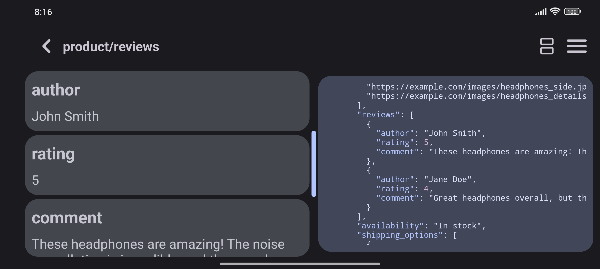

# JsonList
Introducing a Material You Android application for previewing JSON from a file or URL in a user-friendly list format.

Or download the latest APK from the [Releases Section](https://github.com/SlaVcE14/JsonList/releases/latest).

[Desktop app coming soon..](https://github.com/SlaVcE14/JsonList-Desktop)

Use the convenient split view feature that allows simultaneous display of the raw JSON string alongside the list representation.

Enjoy the flexibility of dynamic color support, adapting to your Material Design preferences.

## Stargazers over time

